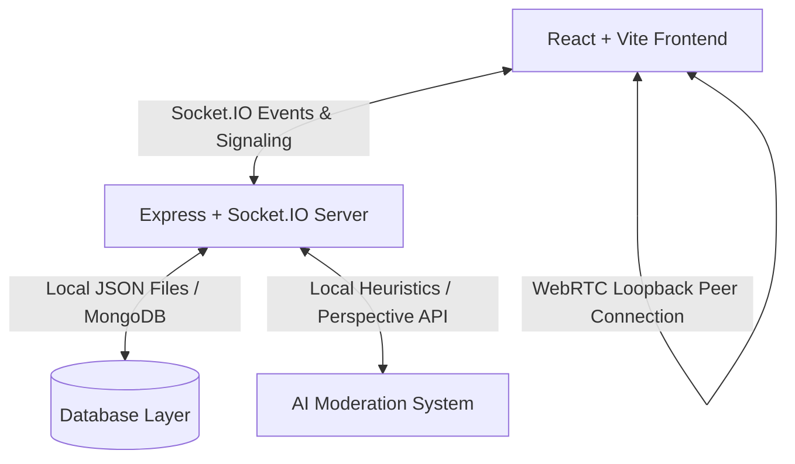

# AnonMeet AI (ConnectX)

**AnonMeet AI** is a premium, real-time anonymous matching and communication platform architected as a major resume/portfolio piece. Built with high-fidelity React, Node.js, Express, Socket.IO, and WebRTC, it features multi-dimensional matching algorithms, dynamic AI toxicity moderation, and a mutual contact exchange safety lock.

To allow instant, zero-setup testing, the platform features a custom **In-Memory/JSON database** and a highly functional **Interactive Bot Simulation mode** where users can experience WebRTC pairing, real-time chat, toxicity filtering, typing indicators, and mutual contact unlocks locally.

---

## Technical Stack & Architecture

- **Frontend:** React + Vite, Custom HSL Styling variables, Glassmorphism, CSS Animations, Synthesized Web Audio API sound chime.
- **Backend:** Node.js, Express.js, Socket.IO, WebRTC Signaling.
- **AI Moderation:** Regex pattern classifier, screamed CAPS analysis, profanity scanning, Google Perspective API integration.
- **Database System:** Repository pattern interface layers utilizing local JSON files (highly portable) and easily swappable with standard MongoDB/Mongoose.



---

## Main Product Features

### 1. Authentication (Mock Firebase Flow)
- Implements glassmorphic forms for OTP-based email and phone number inputs, complete with simulated code checks (enter `123456` or click "Instant Local Demo Login" for quick access).

### 2. Matching Engine & Scoring Algorithm
- Pairs users in real-time based on gender and partner preferences.
- Calculates compatibility scores (0% to 100%) based on:
  - **Age differences** (penalizes wide gaps).
  - **Shared interests** (+15 points per common interest tag).
  - **Regional/Country matches** (+15 points).

### 3. Real-Time Chat & AI Moderation
- Fully responsive text messaging.
- **Real-Time AI Moderation:** Messages are scanned in real-time. Toxic inputs are instantly blocked, alerting the sender with an inline safety warning, while keeping the receiver safe from offensive content.
- Dynamic **typing indicators** and **online presence** indicators.

### 4. High-Fidelity WebRTC Video Streaming
- Implements real camera capturing (`getUserMedia`) and WebRTC visual structures.
- To facilitate single-device developer evaluations, video feeds include local loopbacks rendering local feeds inside both channels.

### 5. Secure Mutual Contact Exchange Lock
- Encourages safer stranger chat interactions.
- Users input their username (Instagram / Telegram / WhatsApp) privately.
- Pressing "Share Socials" sends an invitation to the peer.
- The details are **fully unlocked and revealed only when BOTH users agree**. Unlocking triggers a custom arpeggiated sound chime synthesized via the **HTML5 Web Audio API**.

---

## Quick Setup & Local Launch

Ensure you have **Node.js** installed on your machine.

### 1. Install Dependencies
Run the project-level concurrent setup command from the project root:
```bash
npm run install:all
```
This automatically runs `npm install` inside the root, `server/`, and `client/` directories.

### 2. Start Application Concurrently
Boot the backend server (Port 5000) and Vite React app (Port 5173) in one shell session:
```bash
npm run dev
```

### 3. Open Browser
Open **`http://localhost:5173`** to interact with the platform!

---

## Evaluating the Platform Solo: "AI Bot Simulator"

1. Open `http://localhost:5173` in your browser.
2. Sign in via the **Instant Local Demo Login**.
3. Choose your gender, age, preference, and tags, and click **Save & Launch Lobby**.
4. In the lobby, click **Force Bot Match** to trigger the offline simulation.
5. The system will match you with a virtual conversational partner (e.g. `Sophia (AI Bot)`).
6. **Chatting:** Say hello! Sophia will display a realistic typing indicator and reply contextually.
7. **Toxicity Verification:** Type a message with profanity (e.g., "kill yourself" or "asshole"). Notice that the AI Moderation intercepts the message, blocks it, and alerts you to keep the chat clean!
8. **Contact Unlock:** Click the **Share Socials** button at the top, enter a username, and press submit. The bot will wait 1.5 seconds, send its request, and automatically unlock both social cards with a success arpeggio chime!
9. **Next Match:** Click **Next Stranger** or **Block / Report** to safely sever the session and return to the matchmaking lobby.
